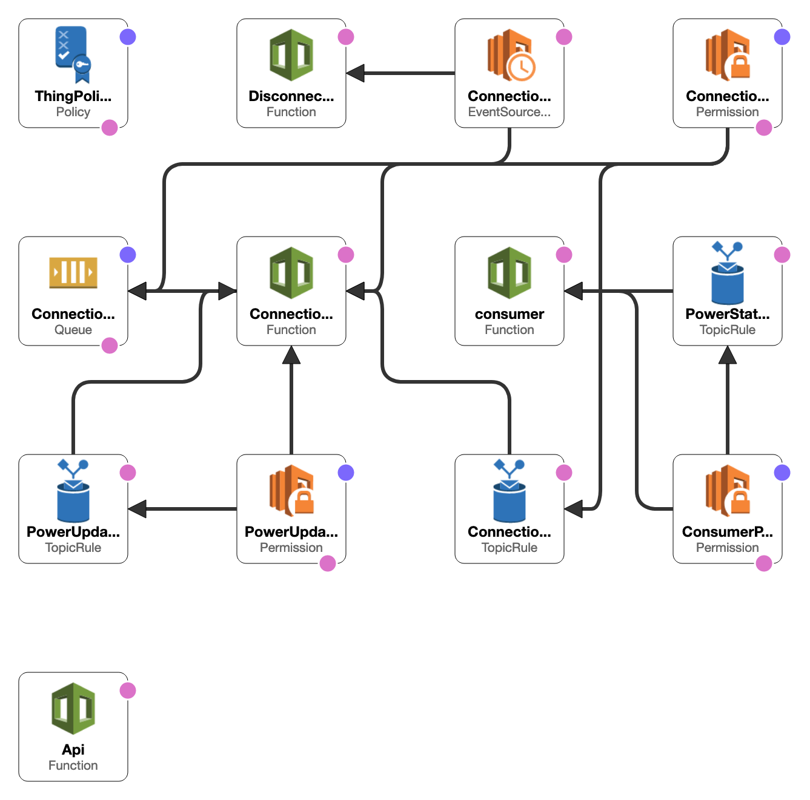

[](https://circleci.com/gh/briggySmalls/detectordag)

# detectordag

Power outage detector made with ♥ by a dag.

## Introduction

This is an IoT project that uses 'dags' to monitor the power whilst you are away from home.
You can read the motivation on my [blog](https://sambriggs.dev/posts/detector-dag/introduction/).

The 'dags' (RaspberryPi-Zero + a small UPS) report status updates to a serverless application hosted on AWS.
Status updates are communicated to end-users via email, or may be checked asynchronously at
[detectordag.tk](https://detectordag.tk).

## Architecture

Broadly the system divides in two:
- Edge devices
- 'the cloud'

An edge device is a RaspberryPi-Zero device paired with the UPS-Lite uninterruptable power supply
and an LTE dongle for connectivity. Software is deployed via [BalenaCloud](https://www.balena.io/cloud/),
along with other fleet management tasks.

The cloud sub-system is a collection of serverless entities on AWS:
including IoT Core, Lambda, API gateway, SQS.
The Cloudformation designer, when supplied this project's [template.yml](./template.yml) gives this spaghetti mess:



The following list gives an overview of the subdirectories of this project:

- **api/**: contains a JSON REST API written in Go deployed as an AWS lambda
- **consumer/**: AWS Lambda written in Go for processing 'power status changed' MQTT events
- [**connection/**](./connection/README.md): contains two further AWS IoT lambdas to debounce connection status events
- **edge/**: Python application to run on the Raspberry Pi
- **frontend/**: Vue.js frontend, deployed at [detectordag.tk](https://detectordag.tk)

# Installation

This project uses a few different tools:

## Mage

The project generally uses [mage](https://github.com/magefile/mage) for project build commands, which retrospectively was a pain-in-the-arse, but oh well...

```bash
go get -u -d github.com/magefile/mage

go run bootstrap.go
```

## AWS CLI

```bash
# Install the general AWS CLI
brew install awscli
# Install the SAM CLI
brew tap aws/tap
brew install aws-sam-cli
```

You will need to download credentials and save them to `~/.aws/credentials` to interact with AWS.

# Provisioning

## Cloud resources

Most AWS resources are provisioned using the CloudFormation `template.yml`.

```bash
# Build the lambda functions
sam build
# Deploy to AWS
sam deploy
```

## Provisioning 'dags'

New devices need to be provisioned on a device-by-device basis.
A handy mage command is provided in order to provision a 'thing' on AWS matching
a device on BalenaCloud, obtaining a build image ready to be flashed to an SD card.

```bash
# Provision a device
env DDAG_DEVICE_ID=3cf9f9b7-b7d2-46db-9e6b-5f80fdfe8aa0 \
    DDAG_DEVICE_NAME=second \
    DAG_ACCOUNT_ID=aac45d02-c97d-442c-8431-336d578fdcf7 \
    mage -v provisionDevice
```

Some notes:

- IoT things should be of Thing Type "detectordag" in order to ensure they have the expected attributes (e.g. account ID)
- IoT things should be a member of Thing Group "detectordag" in order to give them the correct permissions for updating their shadow
